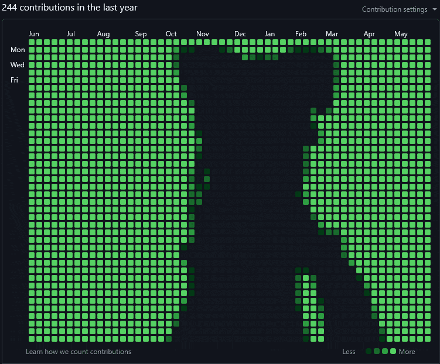

# Jarif Mustavi Aabir
   

### About Me:
🔹 2nd year Computer Science student of RUET  
🔹 Started coding since 5th grade and have been improving myself ever since  
🔹 Knowledgeable in Linux, UI/UX and cyber security  
🔹 Passionate about building lightweight, high-performance applications  

#### More about me:
🔹 I use Arch & Neovim btw  
🔹 Knows too many keyboard shortcuts. They make my life easier  
🔹 A member of the Cyber Security club  
🔹 Did you remember to backup your images?  

> Being a perfectionist is tough: either I give up or make the best thing ever.

---

### Active Projects

- [Darion Logic Sim](https://github.com/riff-exe/darion-logic-sim): A powerful but minimal logic circuit simulator.

### Languages and Tools
<!-- Icons made using Skill Icons: https://github.com/tandpfun/skill-icons -->
  
  
  
_more on the way_

---

### BE THE HACKERMAN THEY THINK YOU ARE 🖥️👩‍💻🖥️

---

  
_All credits for the Bad Apple graph goes to [TimothyWashBurn](https://github.com/timothywashburn/badapple)_

<!-- ----------------------------------------------------------

🔹 _Online, you might know me as Riff_
🔹 Fast learner: Give me some time and I'll learn a new language/framework

# Tech Stack
        

# GitHub Stats: GitHub stats (stars, commits, PR)

# GitHub Stats: Total contribution and streak stat

# GitHub Stats: Most used languages

# Badges: LinkedIn

---------------------------------------------------------- -->
